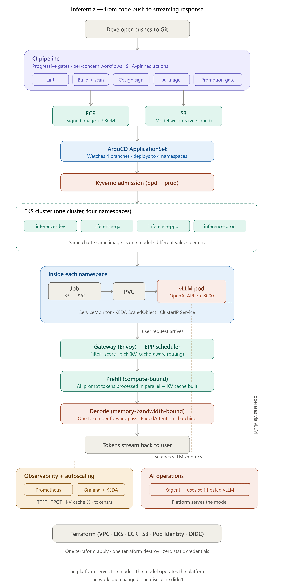
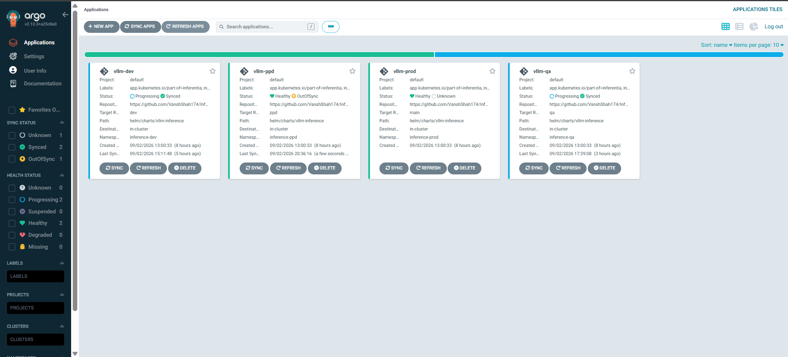
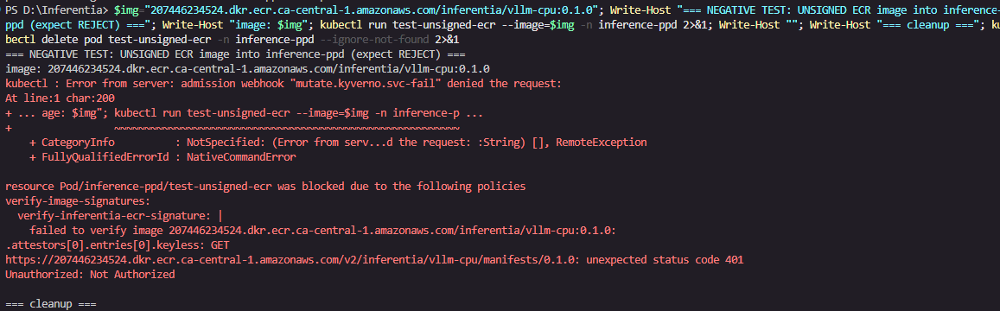
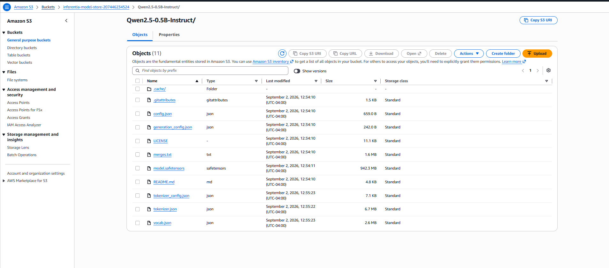
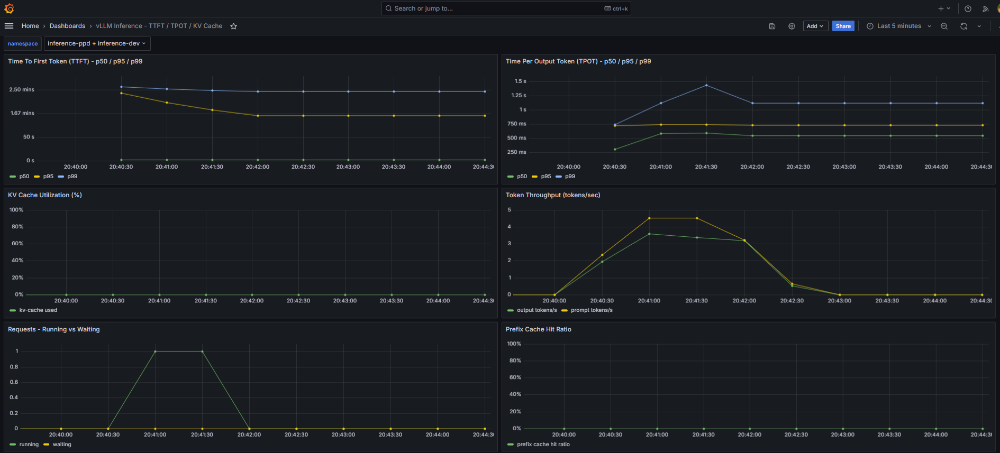
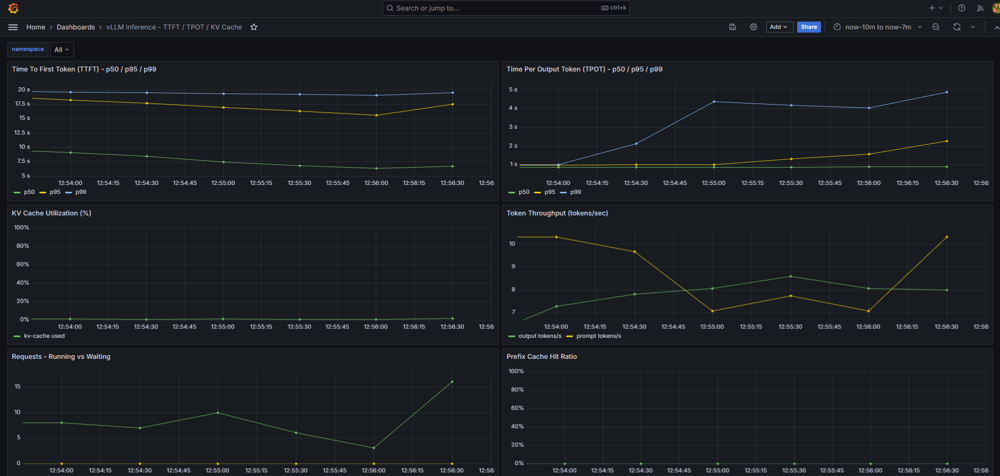
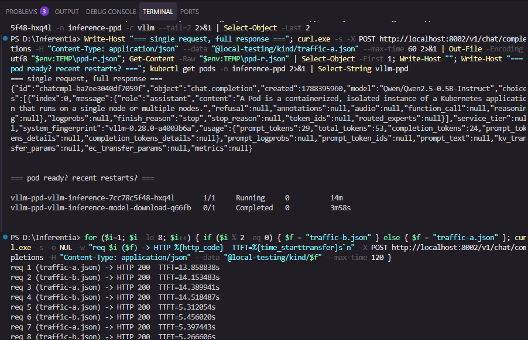
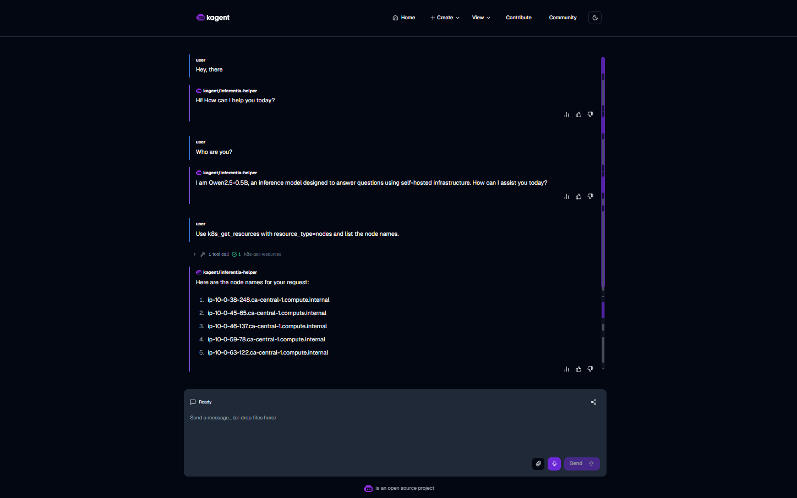

# Inferentia

**A self-hosted, end-to-end LLM inference platform on Amazon EKS** — exploring where standard DevOps practice applies unchanged to AI workloads and where it must be extended for a workload that batches requests, holds per-request state in memory, and scales on token throughput rather than request rate.

> **The workload changed. The discipline didn't.**

Inferentia runs an open-weights model (**Qwen2.5-0.5B-Instruct**) inside **vLLM** on EKS, exposed as an OpenAI-compatible API, and wraps it in the full operational envelope a real inference platform needs: infrastructure-as-code, a signed-and-scanned CI supply chain, GitOps promotion across four environments, admission-time policy enforcement, inference-aware observability and autoscaling, cache-aware routing, and an agentic operations layer (kagent + MCP) that reasons **on the self-hosted model itself**.

The model is deliberately small and CPU-served — the *platform* around it is the deliverable.

---

## Table of Contents

- [What Was Built & Proven](#what-was-built--proven)
- [Architecture](#architecture)
- [Screenshots / Evidence](#screenshots--evidence)
  - [1. GitOps — ArgoCD across dev/qa/ppd/prod](#1-gitops--argocd-across-devqappdprod)
  - [2. Supply-Chain Enforcement — Kyverno blocks unsigned images](#2-supply-chain-enforcement--kyverno-blocks-unsigned-images)
  - [3. Self-Hosted Weights — S3 model store](#3-self-hosted-weights--s3-model-store)
  - [4. Inference Observability — Grafana](#4-inference-observability--grafana)
  - [5. Cache-Aware Routing — TTFT under shared-prefix load](#5-cache-aware-routing--ttft-under-shared-prefix-load)
  - [6. Agentic Ops — kagent + MCP on the self-hosted model](#6-agentic-ops--kagent--mcp-on-the-self-hosted-model)
- [Tech Stack](#tech-stack)
- [Repository Layout](#repository-layout)
- [GitOps Branch Strategy](#gitops-branch-strategy)
- [CI/CD Supply Chain](#cicd-supply-chain)
- [Security & Policy (Kyverno)](#security--policy-kyverno)
- [Observability & Autoscaling](#observability--autoscaling)
- [Cache-Aware Routing (llm-d)](#cache-aware-routing-llm-d)
- [Agentic Operations (kagent + MCP)](#agentic-operations-kagent--mcp)
- [Getting Started](#getting-started)
- [Honest Limitations](#honest-limitations)
- [License](#license)

---

## What Was Built & Proven

| Capability | Status | Evidence |
|---|---|---|
| Infrastructure as Code (VPC, EKS, ECR, S3, OIDC, Pod Identity) | ✅ Provisioned via Terraform | `terraform/` |
| Model artifact store (weights in S3, pulled at pod init) | ✅ | [S3 screenshot](#3-self-hosted-weights--s3-model-store) |
| Signed + scanned container supply chain (CI) | ✅ | `.github/workflows/` |
| Admission policy enforcement (unsigned image rejected) | ✅ Negative test passes | [Kyverno screenshot](#2-supply-chain-enforcement--kyverno-blocks-unsigned-images) |
| GitOps across 4 envs (dev → qa → ppd → prod) | ✅ All served | [ArgoCD screenshot](#1-gitops--argocd-across-devqappdprod) |
| Signed-image promotion gate (cosign verify on promote) | ✅ PR merged, digest verified | `.github/workflows/promotion-gate.yaml` |
| Inference-aware observability (TTFT/TPOT/KV-cache/throughput) | ✅ Custom Grafana dashboard | [Grafana screenshot](#4-inference-observability--grafana) |
| Autoscaling on inference signals (KEDA) | ✅ Scaled prod 1→3 under load | `helm/charts/observability/keda-scaledobject.yaml` |
| Cache-aware routing (Gateway API Inference Extension / llm-d) | ✅ CRs authored + validated | `helm/charts/llm-d/` |
| Agentic ops on the self-hosted model (kagent + MCP tools) | ✅ Agent queries live cluster via MCP | [kagent screenshot](#6-agentic-ops--kagent--mcp-on-the-self-hosted-model) |

---

## Architecture

**From code push to streaming response** — one cluster, four environments, a signed supply chain, and an agentic ops loop that runs on the platform's own model.



> Editable source of this diagram (renders on GitHub as Mermaid): [`docs/architecture.md`](docs/architecture.md).

**Five layers:**
1. **Serving** — vLLM (continuous batching, PagedAttention, prefix caching), OpenAI-compatible API.
2. **Routing** — llm-d / Gateway API Inference Extension (InferencePool + Endpoint Picker), cache-aware.
3. **Kubernetes primitives** — EKS, Gateway API CRDs, Kyverno admission, KEDA + HPA.
4. **DevOps toolchain** — Terraform, Helm, ArgoCD ApplicationSet, four-branch GitOps.
5. **Security, observability & agentic ops** — signed CI supply chain, runtime policies, inference SLOs, kagent + MCP.

---

## Screenshots / Evidence

All images live in [`Screenshots/`](Screenshots/).

### 1. GitOps — ArgoCD across dev/qa/ppd/prod

All four environments deployed from their own branch (`dev`, `qa`, `ppd`, `main`) into their own namespace (`inference-dev/qa/ppd/prod`) via a single ArgoCD ApplicationSet. Each app shows its target revision, repo, path (`helm/charts/vllm-inference`) and destination namespace.



### 2. Supply-Chain Enforcement — Kyverno blocks unsigned images

Negative test: attempting to run an **unsigned** ECR image is rejected at admission by the Kyverno `verify-image-signatures` policy — `failed to verify image ... keyless ... 401 Unauthorized`, `Pod ... was blocked due to the following policies`. Only cosign-signed images from CI can run.



### 3. Self-Hosted Weights — S3 model store

The Qwen2.5-0.5B-Instruct weights (`model.safetensors` ~942 MB, tokenizer, config) live in the project's S3 model store and are pulled into each pod at init time — no dependency on Hugging Face at runtime, no cloud LLM API.



### 4. Inference Observability — Grafana

A purpose-built vLLM dashboard tracks the metrics that actually matter for LLM serving: **Time To First Token (TTFT)** and **Time Per Output Token (TPOT)** at p50/p95/p99, **KV cache utilization**, **token throughput**, **running vs. waiting requests**, and **prefix cache hit ratio** — selectable per namespace.



Multi-namespace view (prod + qa) under load:



### 5. Cache-Aware Routing — TTFT under shared-prefix load

Firing requests that share a long system-prompt prefix (`traffic-a.json` / `traffic-b.json`) and measuring TTFT per request — the basis for the prefix-cache routing story (warm-KV replicas answer faster).



### 6. Agentic Ops — kagent + MCP on the self-hosted model

The headline. A **kagent** agent (`inferentia-helper`) whose model backend is the **self-hosted vLLM** (not a cloud API) answers "Who are you?" → *"I am Qwen2.5-0.5B, an inference model … using self-hosted infrastructure"*, then, asked to list cluster nodes, it **invokes an MCP tool** (`k8s-get-resources`, shown as a succeeded tool call) and returns the **real node names** from the live cluster.

This proves the full chain end-to-end: **kagent agent → self-hosted Qwen2.5-0.5B vLLM → MCP tool server → live Kubernetes API.**



---

## Tech Stack

| Layer | Tools |
|---|---|
| Infrastructure | Terraform, AWS EKS, VPC, ECR, S3, IAM, GitHub OIDC, EKS Pod Identity |
| Inference | vLLM (CPU, PagedAttention, prefix caching), Qwen2.5-0.5B-Instruct |
| Routing | llm-d, Gateway API + Gateway API Inference Extension (InferencePool/EPP), kgateway |
| Packaging | Helm (per-env values), Docker (multi-stage, digest-pinned) |
| GitOps | ArgoCD + ApplicationSet, four-branch promotion |
| CI Security | Gitleaks, Trivy, Syft (SBOM), Cosign (keyless signing), promotion gate |
| Admission | Kyverno (verify-image-signatures, resource hygiene, pod-security, network policy) |
| Observability | Prometheus, Grafana, kube-prometheus-stack |
| Autoscaling | KEDA (KV-cache utilization + request queue-depth), HPA |
| Agentic Ops | kagent (agents on Kubernetes), Model Context Protocol (MCP) tool server |

---

## Repository Layout

```
containers/    Dockerfiles for images we build (vLLM CPU image)
helm/          Deployment charts + per-env values
  charts/vllm-inference/     the model-serving chart (dev/qa/ppd/prod values)
  charts/observability/      KEDA ScaledObject, Grafana dashboards
  charts/llm-d/              Gateway API Inference Extension CRDs + routing CRs
  charts/kagent/             kagent agent + MCP NetworkPolicy
manifests/     Non-Helm bootstrap objects (namespaces, Kyverno install)
argocd/        ApplicationSet + GitOps definitions
policies/      Kyverno admission policies (supply-chain, resource-hygiene, ...)
terraform/     IaC — modules + platform environment
ci/            CI helpers (scan triage, signing, promotion gates)
docs/          Architecture, decisions, trade-offs, deployment notes
Screenshots/   Evidence images referenced in this README
```

---

## GitOps Branch Strategy

```
main  ← production      (inference-prod)   — protected, promotion-gated
ppd   ← pre-production  (inference-ppd)
qa    ← integration     (inference-qa)
dev   ← development      (inference-dev)
```

Changes flow `dev → qa → ppd → main`. An ArgoCD **ApplicationSet** generates one Application per branch/namespace, injecting the ECR repo and S3 bucket via Helm parameters so the chart stays generic. Promotion to `main` is a pull request gated by a **cosign signature verification** of the exact image digest being promoted.

---

## CI/CD Supply Chain

Every image that reaches the cluster is built and vetted by CI (`.github/workflows/build-and-scan.yaml`):

1. **Secret scan** (Gitleaks) and **IaC/vuln scan** (Trivy).
2. **Build** the vLLM CPU image (multi-stage Dockerfile).
3. **SBOM** generation (Syft).
4. **Keyless sign** with Cosign (GitHub OIDC — no long-lived keys), producing a signature tied to the image **digest**.
5. On promotion (`promotion-gate.yaml`), the target image digest is **re-verified** against its cosign signature before it's allowed into `main`/prod.

The result is a chain of custody from commit → signed digest → admission.

---

## Security & Policy (Kyverno)

Kyverno enforces at **admission** what CI produced at **build**:

- **`verify-image-signatures`** — only cosign-signed images from the project's ECR may run (see [screenshot #2](#2-supply-chain-enforcement--kyverno-blocks-unsigned-images)). Unsigned images are rejected with a `401 Unauthorized` on signature lookup.
- **Resource hygiene** — requests/limits and readiness/liveness probes required on long-running containers.
- **Pod security** — non-root, drop-all-capabilities, no privilege escalation.
- **Network policy** — namespaces are default-deny ingress; explicit allow-rules grant only the traffic each consumer needs (e.g. a least-privilege rule lets the `kagent` namespace reach vLLM:8000).

---

## Observability & Autoscaling

**Observability** — a custom Grafana dashboard (see [screenshots #4](#4-inference-observability--grafana)) surfaces the LLM-specific SLIs: TTFT, TPOT, KV-cache utilization, token throughput, and running-vs-waiting request depth.

**Autoscaling (KEDA)** — CPU is a poor proxy for LLM saturation, so KEDA scales on inference signals:
- **KV-cache utilization** (`vllm:kv_cache_usage_perc`) — the production-intent signal.
- **Request queue depth** (`num_requests_running + num_requests_waiting`) — the signal that actually moves for a small CPU-served model under concurrency.

Under a 300-request / 16-concurrency load test, KEDA scaled prod **1 → 3** replicas on the queue-depth trigger, then scaled back down after cooldown.

---

## Cache-Aware Routing (llm-d)

The routing plane uses the **Gateway API Inference Extension** (v1.6.0): an `InferencePool` groups the vLLM replicas and an **Endpoint Picker (EPP)** scores pods so that requests sharing a prompt prefix are routed to a replica whose KV cache is already warm — reducing TTFT. The CRs (`InferencePool`, `Gateway`, `HTTPRoute`, EPP) are authored and schema-validated against the pinned CRDs in `helm/charts/llm-d/`, with kgateway as the Gateway controller.

---

## Agentic Operations (kagent + MCP)

Inferentia closes the loop with an **agentic operations layer** that runs on the platform's *own* model:

- **kagent** is installed via Helm and its default `ModelConfig` points at the in-cluster vLLM service (`http://vllm-prod-vllm-inference.inference-prod.svc.cluster.local:8000/v1`) — the agent's "brain" is the self-hosted Qwen2.5-0.5B, **not** a cloud LLM.
- A Declarative agent (`inferentia-helper`) attaches read-only Kubernetes tools (`k8s_get_resources`, `k8s_describe_resource`, `k8s_get_events`) from kagent's built-in **MCP tool server** (124 tools total).
- Asked a live question, the agent **calls the MCP tool** and returns real cluster state (see [screenshot #6](#6-agentic-ops--kagent--mcp-on-the-self-hosted-model)).

This makes vLLM enable tool-calling (`--enable-auto-tool-choice --tool-call-parser hermes`) and demonstrates a self-contained AIOps loop: an operator can ask questions about the cluster and the platform's own model answers them by invoking tools.

---

## Documentation

- 📘 **[LLM Inference Infrastructure — A DevOps Reference (PDF)](docs/LLM_Inference_Infrastructure_Reference.pdf)** — a full reference on how LLM inference works end to end, from GPU silicon up through Kubernetes, and every DevOps concept in between. Maps the *production-scale* architecture (GPU, disaggregated prefill/decode, RDMA); this build implements the CPU-served slice of it.
- [Architecture & request lifecycle](docs/architecture.md)
- [Architecture decision records](docs/decisions.md)
- [Trade-offs & honest limitations](docs/trade-offs.md)
- [Hurdles & lessons (the honest engineering log)](docs/Hurdles-and-Lessons.md)
- [KV cache & cache-aware routing](docs/kv-cache-and-routing.md)
- [SSDLC / DevSecOps](docs/SSDLC-DevSecOps.md)
- [Keyless OIDC auth](docs/OIDC-Keyless-Auth.md)

---

## Getting Started

```bash
# Clone
git clone https://github.com/VanshShah174/Inferentia.git
cd Inferentia

# Pre-commit hooks (Gitleaks, yamllint, etc.)
pip install pre-commit && pre-commit install

# Provision the platform (VPC/EKS/ECR/S3/OIDC/Pod-Identity)
cd terraform/environments/platform
terraform init && terraform apply

# Point kubectl at the cluster
aws eks update-kubeconfig --name inferentia-eks --region ca-central-1

# Bootstrap: Kyverno + policies, kube-prometheus-stack, KEDA, ArgoCD + ApplicationSet
#   (see manifests/bootstrap and argocd/ )

# ArgoCD then reconciles dev/qa/ppd/prod from their branches.
```

> **Cost note:** this runs a real EKS cluster. Remember to `terraform destroy` when you're done.

---

## Honest Limitations

This is a **portfolio/reference platform**, and the trade-offs are deliberate and documented:

- **Model is tiny and CPU-served.** Qwen2.5-0.5B on CPU is a placeholder to keep costs low. KV-cache and prefix-cache-hit panels often read near-zero because the model rarely fills the cache — the *instrumentation* is the point, not the numbers.
- **The 0.5B model is weak at tool-calling.** It reliably invokes MCP tools when the prompt names the tool and arguments; free-form tool selection is hit-or-miss. Expected for a model this size.
- **llm-d prefix-cache routing** is authored and CRD-validated but capacity-bounded on the small demo cluster; the routing CRs and Endpoint Picker are in place, and the serving/observability of prefix caching is demonstrated.
- **Single-node model PVC** (ReadWriteOnce) — real multi-node HA would use RWX/EFS or per-pod weights; the demo uses the simplest correct option per environment.

---

## License

[Apache-2.0](LICENSE)
