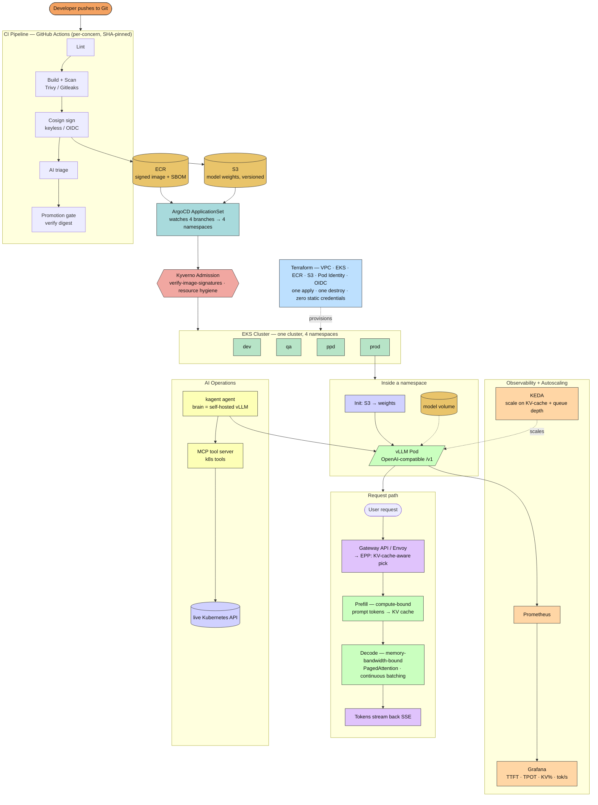

# Inferentia — Architecture

**From code push to streaming response.** This diagram renders natively on GitHub (Mermaid).

> The platform serves the model. The model operates the platform.
> **The workload changed. The discipline didn't.**
